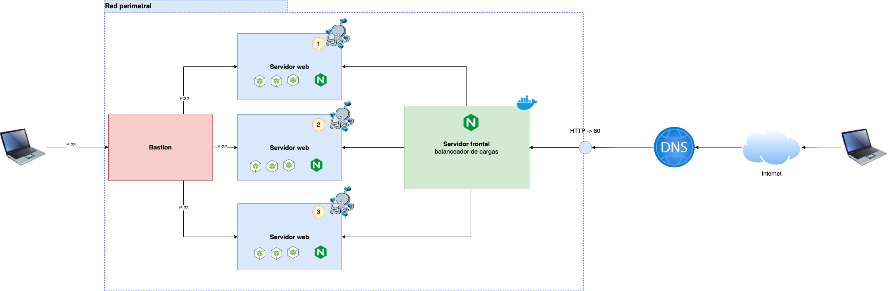

# Balanceo de Cargas  de Alta Disponibilidad

Este repositorio contiene un sistema de balanceo de cargas entre tres contenedores Debian de Docker:
* server1
* server2
* server3

Cada uno de estos servidores está controlado por un contenedor con imagen NGINX, llamado __balancer__, y por un archivo __nginx.conf__. 

Además, existe otro servidor llamado __bastion__. Este contenedor Debian se encuentra conectado a los tres contenedores (server1, server2, server3) por medio de una red: __loadnetwork__. 

Para poder completar la conexión entre estos contenedores, se utiliza una llave privada generada por __bastion__ que se agrega a __server1__, __server2__ y __server3__.

__Dockerfile.bastion__ es la imagen de Docker que utiliza __bastion__. Se encarga de obtener una imagen Debian, instalar los paquetes necesarios, generar una llave con el comando `ssh-keygen -t rsa` y copiarla a la carpeta __authorized_keys__.

__Dockerfile.server__ es la imagen de Docker que utilizan los contenedores server1, server2 y server3. Se encarga de obtener una imagen Debian, instalar los paquetes necesarios y tomar la llave generada por __bastion__ y copiarla a las carpetas de __authorized_keys__ de cada contenedor.

A su vez, __bastion__ contiene un archivo __playbook.yml__ de Ansible que se encarga de copiar tres archivos diferentes a cada contenedor:

* docker-compose-1.yml
* docker-compose-2.yml
* docker-compose-3.yml

El archivo Ansible también inicia el servicio de Docker dentro de los contenedores y ejecuta el comando `docker compose up -d` para levantar tres instancias en estos.

La arquitectura de este sistema puede ser representado por este diagrama:

	

## Cómo utilizar el repositorio

1. Clonar el repositorio
```
git clone https://github.com/mus1cian/Load-Balancer
```

2. Dentro de la carpeta __loadbalancer__, ejecutar el siguiente comando:

```
docker compose build
```

3. Después, ejecutar el comando:
```
docker compose up -b
```
4. Una vez que los contenedores se hayan creado y estén prendidos, se debe acceder al bash del contenedor bastion
```
docker exec -ti loadbalancer-bastion-1 /bin/bash
```

5. Acceder al bash de los contenedores server1, server2 y server3
```
docker exec -ti loadbalancer-server1-1 /bin/bash
docker exec -ti loadbalancer-server2-1 /bin/bash
docker exec -ti loadbalancer-server3-1 /bin/bash
```

6. Dentro de bastion, ejecutar el archivo playbook.yml
```
ansible-playbook playbook.yml
```

El resultado son tres diferentes instancias en cada contenedor llamadas __app-i1__, __app-i2__, y __app-i3__.